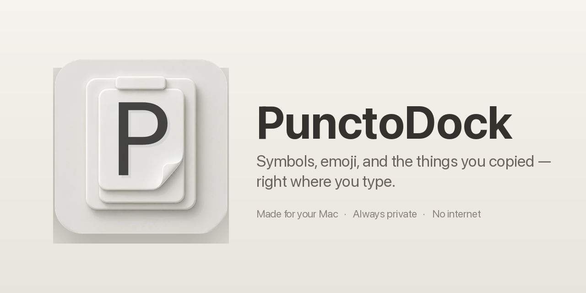
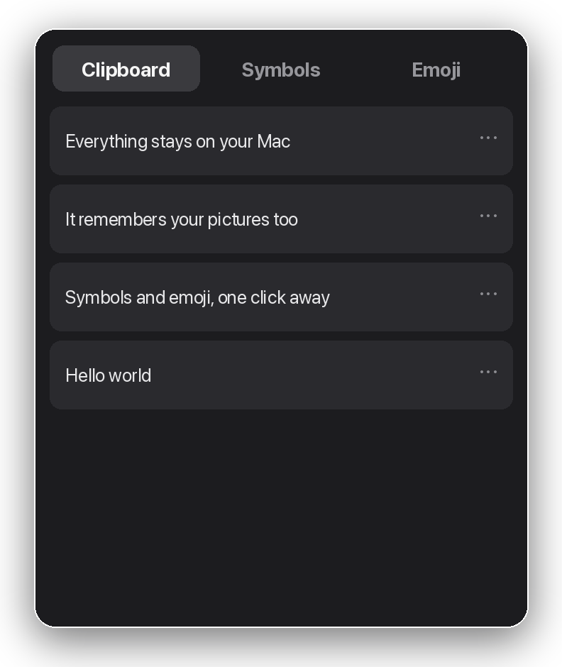
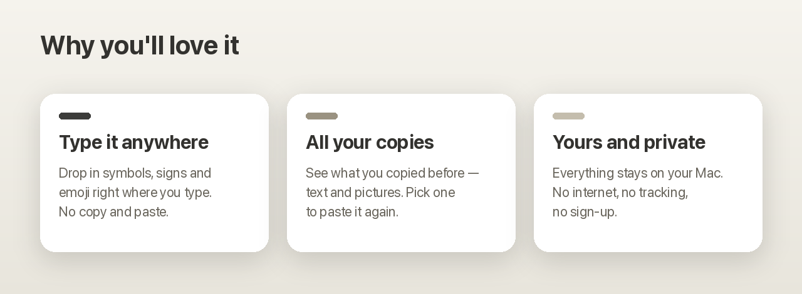

<p align="center">
  
</p>

# PunctoDock

**The easy way to type symbols, emoji, and the things you copied — right where you're typing.**

Press your shortcut from any app. A small window pops up next to your mouse. Click a symbol, sign, emoji, or an old copy — and it drops straight into your text. No copy and paste.

<p align="center">
  
</p>

<p align="center">
  
</p>

> Works on **macOS 26 or later**.

---

## What it does

The window has three tabs:

| Tab | What's inside |
|---|---|
| **Clipboard** | The things you copied recently — click one to paste it |
| **Symbols** | Punctuation, brackets, arrows, currency, and other signs |
| **Emoji** | The emoji picker |

- **Goes where you type** — what you pick lands in the app you're using. No copy and paste.
- **Learns your favourites** — the symbols you use most move to the front.
- **Brackets and quotes in pairs** — they open and close, with your cursor in the middle.
- **Remembers your copies** — recent text and pictures; pin the ones you want to keep.
- **Show a picture in Finder** — right-click any image in the list.
- **Works with all common pictures** — PNG, JPEG, GIF, HEIC, PDF and more, plus image files you copy in Finder.
- **A menu bar icon** (optional) — click to open, right-click for a quick menu.
- **Private** — everything stays on your Mac. No internet, no account.

---

## What you need

| | |
|---|---|
| **Mac** | macOS 26 or later |
| **Chip** | Apple Silicon or Intel |
| **One permission** | Accessibility — so PunctoDock can type into other apps |

---

## How to install

### Easiest way — download

1. Open [Releases](../../releases) and download the latest `PunctoDock.zip`.
2. Unzip it. You get `PunctoDock.app`.
3. Drag `PunctoDock.app` into your **Applications** folder.
4. **Right-click it → Open**, then click **Open** again. (You only do this the first time. macOS shows a warning for apps that aren't from its store — this is normal.)

### For developers — build it yourself

You need Xcode 26 or later (the app targets macOS 26).

```bash
git clone https://github.com/Nayrak2701/punctodock.git
cd punctodock
./setup_signing.sh             # one-time: stable signing so the permission sticks across builds
python3 generate_xcodeproj.py  # regenerates PunctoDock.xcodeproj
```

Open `PunctoDock.xcodeproj` in Xcode and press **⌘R**.

---

## First time: give it permission

PunctoDock types for you by sending a paste (⌘V) into the app you're using. macOS asks for your okay first. **You'll be asked once, right after you open it.**

1. In the PunctoDock window, click **"Open the setting…"**.
2. System Settings opens at **Privacy & Security → Accessibility**.
3. Find **PunctoDock** in the list and switch it **on**.
4. Go back to PunctoDock — you'll see a green checkmark.

That's it. You won't be asked again (unless you move or reinstall the app).

> **No permission yet?** PunctoDock still helps — it copies your symbol so you can paste it yourself with **⌘V**.

---

## How to use it

| You do this | This happens |
|---|---|
| Press your shortcut (starts as **⌥V**) | The window opens next to your mouse |
| Click a symbol | It goes into your app, the window closes |
| Press **Escape** | The window closes, nothing added |
| Arrow keys + Enter | Move and choose with the keyboard (Symbols tab) |
| Right-click a copied item | Pin, delete, clear, or (for pictures) show in Finder |
| Click the menu bar icon | Opens the window; right-click for settings or quit |

**Want a different shortcut?** Open Settings and pick your own. You can also turn on a mouse-wheel double-click to open it.

See [docs/PASTE_COMPATIBILITY.md](docs/PASTE_COMPATIBILITY.md) for how pasting works and a per-app check.

---

## Settings

| Setting | What it does |
|---|---|
| Open with a keyboard shortcut | Turn the shortcut on or off |
| Your shortcut | Pick your own keys (starts as ⌥V) |
| Open by double-clicking the mouse wheel | A second way to open it |
| Open automatically when I turn on my Mac | Starts quietly in the background |
| Show the symbols I use most at the top | Sorts by how often you use them |
| Forget which symbols I use most | Resets that |
| Keep pinned items when I clear the list | Keeps your pins when clearing |
| Clear the copy history | Empties the list |
| Show the icon in the top menu bar | Show or hide the menu bar icon |
| Permission to type for you | Shows the permission status |

---

## Your privacy

PunctoDock keeps **only what it needs to work**, and only on your Mac.

- **Kept on your Mac:** your settings, your copy history (text and pictures), and — *only if you turn on "Show the symbols I use most"* — a count of which symbols you use. Turn that off and nothing about your use is kept.
- **Never kept:** anything an app marks as secret (passwords from password managers are ignored), app names, or anything that identifies you.
- **No internet, ever:** no cloud, no syncing, no tracking, no account.
- **To delete everything:** quit PunctoDock, then delete the folder `~/Library/Application Support/com.punctodock.app/`.

---

## Good to know

- After you move or reinstall the app, macOS asks for the Accessibility permission again. That's a macOS rule, not a bug.
- Some password boxes ignore an automatic paste on purpose. PunctoDock then just copies the symbol for you.
- A few apps add a second bracket on their own. PunctoDock still adds the right pair.

More detail: [docs/PASTE_COMPATIBILITY.md](docs/PASTE_COMPATIBILITY.md).

---

## For contributors

```
PunctoDock/
├── App/            AppDelegate + AppState (single source of truth)
├── Panel/          Floating non-activating NSPanel + SwiftUI content
├── Triggers/       Global hotkey (Carbon) + mouse monitor
├── Insertion/      Clipboard save → set → ⌘V → restore
├── Permissions/    AXIsProcessTrusted wrapper
├── LoginItem/      SMAppService (macOS 13+)
├── Model/          Settings, clipboard history, symbol catalog, persistence
└── Resources/      Info.plist, entitlements, app icon
```

No third-party dependencies. Pure Swift + AppKit + SwiftUI + Carbon. Build a release with `./build_release.sh`. See [docs/ROADMAP.md](docs/ROADMAP.md) for planned features.

**Permission across rebuilds:** every Xcode build changes the app's signature, which makes macOS ask for Accessibility again. Run `setup_signing.sh` once to create a stable signing identity so the permission sticks.

---

## License

MIT — see [LICENSE](LICENSE).
